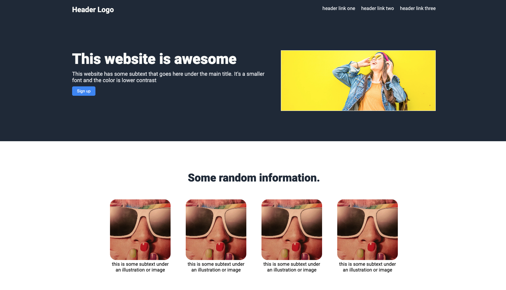

# Project Overview

This is the CSS foundations course in the Odin Project(URL:https://www.theodinproject.com/lessons/foundations-landing-page#viewing-your-project-on-the-web).

The Odin Project is the free course for learning to become a fullstack web developer.

And in this lesson, I have to create an entire web page using CSS skills like FlexBox.
This is not responsive page, but even so, I am confident that I can show to you my CSS fundamental skills.

# Demo Site URL(Not Responsive)

https://hiros-dev.github.io/Landing-Page/

# What did I learn through this course

I got the three concepts of flex box in this course mainly.

One:

I got the fundamental concepts of flex box and how to use it.
For example, I learned the short property flex and the long property flex (flex-grow / flex-shrink / flex-basis)

Two:

I got main axis and cross axis concepts in flex box and how to change it with using "flex-direction".

Three:

And finally, I got knowledge that how to align text in the web page and how to use it.
For example, I created the web page with using "justify-content" and "align-items" property.

## Summary

CSS FlexBox is indispensable skills in today's web world.
But, I think it can not understand easily. (Especially, flex-grow / flex-shrink / flex-basis concepts)

So, it is very useful for me to the course.

Thank you for reading.
And, happy coding!!!

## About my english

I am living in Japan. And I can not use English perfectly.
So, there are may be some mistakes in this texts.
If you do not understand my words, please just ignore or tell me my mistakes. 

## Photo in this git repository

I used the images from the Pixabey. It is royal free.
(Hero section image: https://www.pexels.com/photo/smiling-woman-looking-upright-standing-against-yellow-wall-1536619/)
(Testimonial section image: https://www.pexels.com/photo/fashion-sunglasses-woman-girl-46244/)